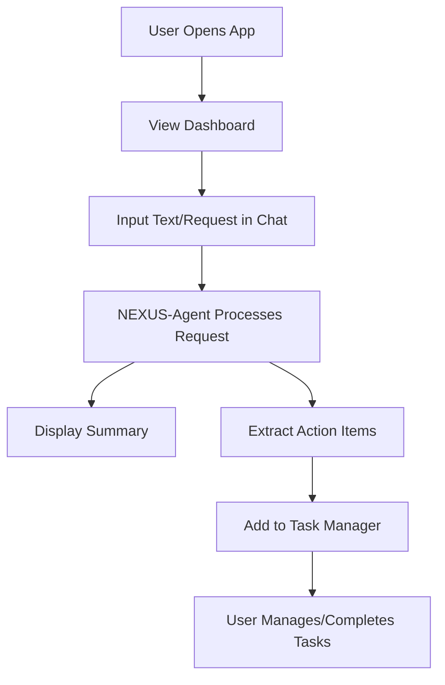

## 1. Product Overview
NEXUS-Agent Web Application
- An AI-powered personal assistant web interface that organizes information, summarizes tasks, and provides workflow direction. Target users are professionals needing a unified dashboard to manage their daily work.
- The product aims to streamline internal workflows by centralizing task management and information summarization in a visually striking, highly interactive dashboard.

## 2. Core Features

### 2.1 User Roles
| Role | Registration Method | Core Permissions |
|------|---------------------|------------------|
| Normal User | Local session (No auth for MVP) | Full access to chat, summaries, and task management |

### 2.2 Feature Module
1. **Dashboard (Home)**: Overview of active tasks, recent summaries, and quick-action buttons.
2. **Chat/Interaction Interface**: The core area where users interact with NEXUS-Agent, input text/files, and receive summaries and actionable items.
3. **Task Manager**: A Kanban-style or list view of extracted action items with status tracking.

### 2.3 Page Details
| Page Name | Module Name | Feature description |
|-----------|-------------|---------------------|
| Dashboard | Hero Overview | Displays greeting, current time/date, and a high-level stats summary. |
| Dashboard | Interaction Panel | A chat-like input area for submitting text/links to the agent. |
| Dashboard | Task View | A side-panel or section showing "Actionable Items" extracted by the agent, allowing users to check them off. |
| Dashboard | History/Summaries | A log of past text summaries generated by the agent. |

## 3. Core Process
User opens app -> Interacts with agent via chat input -> Agent processes text -> Agent returns Summary and Action Items -> Action Items are automatically added to the Task Manager -> User checks off tasks as completed.

## 4. User Interface Design
### 4.1 Design Style
- **Theme**: "Retro-Futuristic Terminal meets Modern Luxury". A bold, high-contrast dark mode aesthetic.
- **Primary Colors**: Deep Obsidian Black (`#0a0a0a`), Neon Cyan (`#00f3ff`), Muted Indigo (`#1e1b4b`).
- **Secondary Colors**: Soft Silver (`#a1a1aa`), Alert Amber (`#f59e0b`) for pending tasks.
- **Typography**: Display font: 'Space Mono' or 'Orbitron' for headers and agent branding. Body font: 'Inter' or 'JetBrains Mono' for clean readability.
- **Layout**: Asymmetric grid. Left sidebar for navigation/history, wide central column for interaction, right sidebar for dynamic task management. Generous padding, glassmorphism effects on panels.
- **Motion**: Smooth, staggered fade-ins for messages. Glowing hover effects on actionable items.

### 4.2 Page Design Overview
| Page Name | Module Name | UI Elements |
|-----------|-------------|-------------|
| Dashboard | Main Layout | 3-column layout (History, Chat, Tasks). Dark theme with neon cyan accents. |
| Dashboard | Chat Interface | Glassmorphic message bubbles. Typing indicators. Monospace font for code/data snippets. |
| Dashboard | Task Manager | Floating card style. Checkboxes with satisfying strike-through animations. |

### 4.3 Responsiveness
- Desktop-first design optimized for wide screens to utilize the 3-column layout.
- Tablet/Mobile: Columns collapse into a tabbed interface or bottom sheet navigation.
