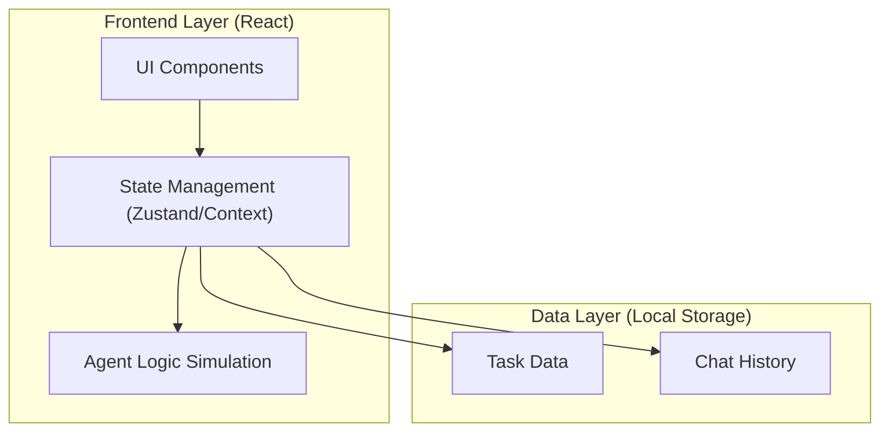
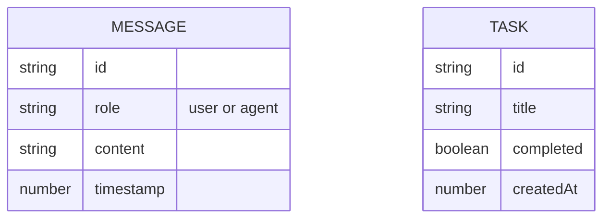

## 1. Architecture Design

## 2. Technology Description
- **Frontend**: React@18 + tailwindcss@3 + vite + lucide-react (icons)
- **Initialization Tool**: vite-init
- **Backend**: None (Client-side only for MVP)
- **State/Database**: Browser `localStorage` to persist chat history and tasks. Simulated AI responses via frontend logic for the prototype.
- **Styling**: Tailwind CSS with custom CSS variables for the retro-futuristic theme. Framer Motion for animations (if needed, or purely CSS).

## 3. Route Definitions
| Route | Purpose |
|-------|---------|
| `/` | Main Dashboard encompassing chat, history, and tasks. Single Page Application (SPA) structure. |

## 4. API Definitions
*No external backend API for the initial MVP. Agent logic will be simulated via async JavaScript functions locally.*

## 5. Data Model

### 5.1 Data Model Definition

